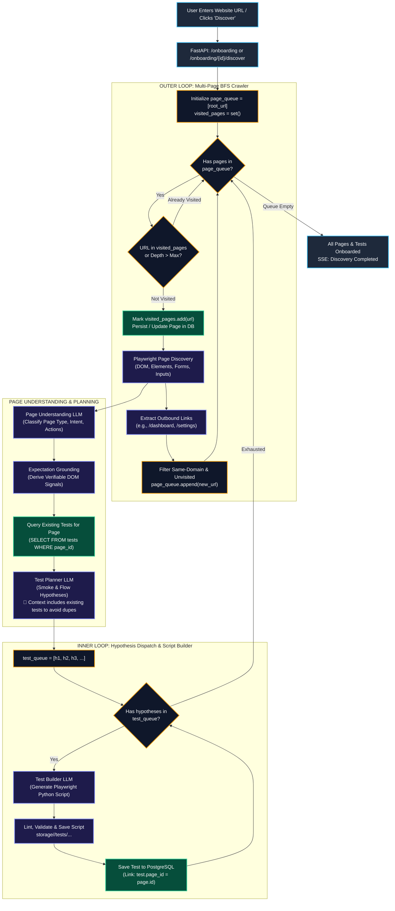
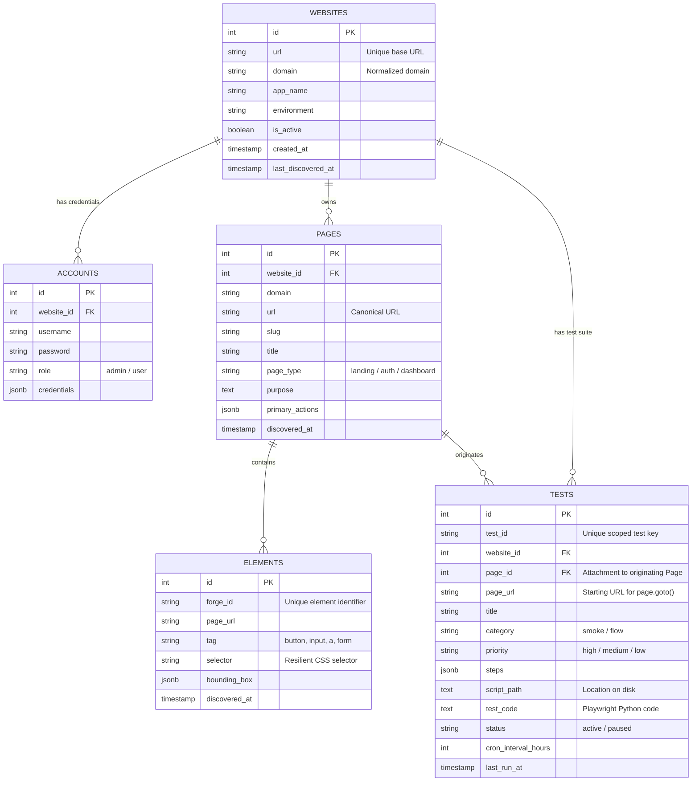
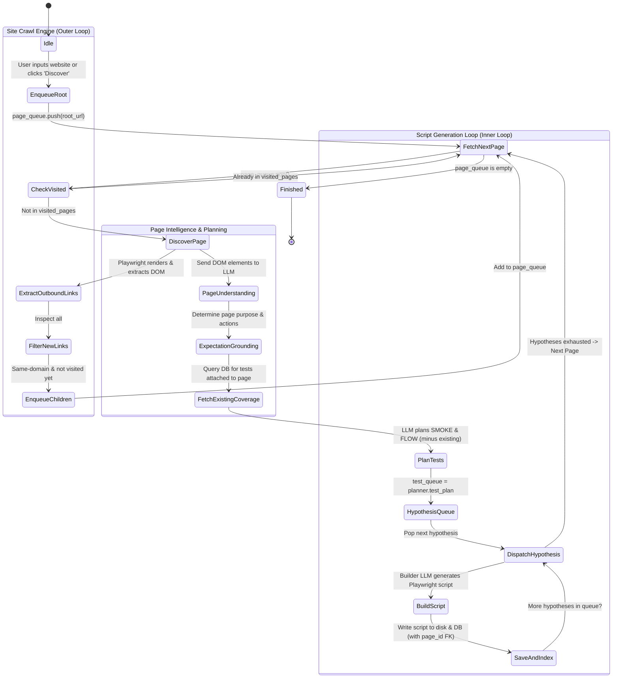

# Multi-Page Discovery, Planning & Test Generation Architecture

## 1. Executive Summary

Forge's autonomous onboarding and discovery pipeline uses a **Dual-Queue Nested Architecture**:
1. **Outer Loop (Site Traversal / Multi-Page Discovery Queue)**:
   - Traverses application routes using a Breadth-First Search (BFS) queue (`page_queue`) and a `visited_pages` registry to discover the whole site without getting trapped in loops.
2. **Inner Loop (Hypothesis Dispatch & Script Builder Queue)**:
   - For every discovered page, semantic analysis identifies capabilities, grounds expectations, pulls existing tests to avoid duplication, synthesizes new test hypotheses, and dispatches them through a `test_queue` to the Playwright test builder.
3. **Page-to-Test Association & Deduplication**:
   - Each test is explicitly linked to its origin page (`page_id` and `page_url`).
   - On re-discovery or reruns, existing test hypotheses for that page are fed to the Planner LLM as negative constraints to prevent duplicate script creation.

---

## 2. End-to-End Architecture Diagram



---

## 3. The Dual-Queue System Explained

### A. Outer Loop: Multi-Page Discovery Queue
When onboarding a web application, inspecting only the homepage leaves internal views (such as `/dashboard`, `/analytics`, `/profile`, `/settings`) uncovered.

- **`page_queue` (FIFO / BFS)**:
  - Seeded with the target starting URL (e.g., `https://app.example.com/`).
  - As each page is rendered in Playwright, `DOM_EXTRACTION_SCRIPT` captures all internal hyperlinks (`<a href="...">`).
  - Links are filtered against:
    1. **Domain boundaries**: Must match site base domain (no external redirects to Twitter, GitHub, etc.).
    2. **Visited registry**: Avoid re-visiting paths already processed.
    3. **Route canonicalization**: Strips URL query tracking params (`utm_source`, `ref`, `fbclid`) and URL fragments (`#section`).
    4. **Max crawl depth**: Prevents crawling endless calendar dates or pagination.
- **`visited_pages` Registry**:
  - Maintained in memory during the crawl run and tracked in PostgreSQL (`pages` table) with timestamps (`discovered_at`, `last_discovered_at`).

### B. Inner Loop: Test Hypothesis & Builder Queue
Once a page is discovered, the Planner generates **multiple** test hypotheses (typically 1–2 SMOKE tests and 3–5 FLOW journeys):

- **Why a queue is required**:
  - LLMs have finite output window limits and higher error rates when trying to generate 5 full Playwright test scripts in a single prompt.
  - Generating one test at a time isolates errors: if 1 test fails linting or code generation, the remaining 4 tests are not aborted.
  - Allows self-healing and deterministic selector attribution per test.
- **Queue Dispatcher (`get_next_hypothesis`)**:
  - Feeds one hypothesis `current_test` to `builder_node`.
  - Upon writing and indexing the test, loops back until `test_queue` is exhausted.

---

## 4. Test-to-Page Attachment & Deduplication

### The Duplication Problem
When a user clicks **"Discover"** on an already onboarded website or re-runs discovery after adding a new page:
- Without page linkage, the Planner blindly invents the same standard tests again (e.g., `smoke_home_navigation`, `flow_login_valid`).
- This results in duplicated test scripts, database clutter, and redundant execution runs.

### The Solution: Page Attachment & Feedback Loop

1. **Explicit Data Association**:
   - `tests.page_id` foreign key points to `pages.id`.
   - `tests.page_url` records the entry route where the Playwright script initiates navigation (`page.goto(page_url)`).

2. **Deduplication Feeding Mechanism**:
   - Before `planner_node` is called for a page:
   ```sql
   SELECT test_id, title, category, steps, expected_outcome
   FROM tests
   WHERE page_id = :page_id OR page_url = :page_url;
   ```
   - These existing tests are formatted into the LLM prompt:
   ```json
   "existing_tests_for_this_page": [
     {
       "test_id": "ws1_flow_login_valid",
       "title": "A user can log into the application with valid credentials",
       "category": "flow"
     },
     {
       "test_id": "ws1_smoke_primary_navigation",
       "title": "Verify homepage loads and header navigation responds",
       "category": "smoke"
     }
   ]
   ```
   - **Planner Directive**:
     > *"The above journeys are ALREADY TESTED. DO NOT regenerate or duplicate these test plans. Only generate new test hypotheses for unverified functional elements, newly added buttons, or unexplored edge cases."*

---

## 5. Database Schema (Entity Relationship Diagram)



---

## 6. Page Crawl & Queue Lifecycle State Machine



---

## 7. Completed Implementation

1. **Database Schema & Migration**:
   - Alembic migration `0004_link_pages_and_tests.py` applied.
   - `pages.website_id` added with Foreign Key to `websites.id` (`ON DELETE CASCADE`) and index `idx_pages_website_id`.
   - `tests.page_id` added with Foreign Key to `pages.id` (`ON DELETE SET NULL`) and index `idx_tests_page_id`.
   - Automatic backfill migrated existing records based on domain and page URL.

2. **SQLAlchemy Models**:
   - [Page](file:///d:/Pramod/Tzylo/ssentra/apps/forge/src/models/core.py#L18-L47): Added `website_id` attribute and updated `to_dict()`.
   - [Test](file:///d:/Pramod/Tzylo/ssentra/apps/forge/src/models/core.py#L84-L140): Added `page_id` attribute and updated `to_dict()`.

3. **Repository Methods**:
   - `ForgeRepository.record_page_discovery(...)`: Stores `website_id` and returns the persisted row with `id`.
   - `ForgeRepository.get_page_by_url(url)` & `get_page_by_id(page_id)`: URL/ID lookups.
   - `ForgeRepository.list_pages_for_website(website_id)`: Returns all discovered pages with aggregated `test_count`.
   - `ForgeRepository.get_tests_for_page(page_id)`: Fetches tests linked to a page.
   - `ForgeRepository.get_tests_for_page_url(page_url)`: Fetches tests linked by page URL.
   - `ForgeRepository.save_test(...)`: Accepts `page_id` and auto-resolves `page_id` from `page_url` if omitted.

4. **Agent Pipeline & Planner Deduplication**:
   - [state.py](file:///d:/Pramod/Tzylo/ssentra/apps/forge/src/agents/state.py): Added `page_id` to `ForgeState`.
   - [understanding.py](file:///d:/Pramod/Tzylo/ssentra/apps/forge/src/agents/nodes/understanding.py): Indexes the discovered page with `website_id` and sets `page_id` in state.
   - [planner.py](file:///d:/Pramod/Tzylo/ssentra/apps/forge/src/agents/nodes/planner.py): Queries existing tests for the page and passes `existing_tests_for_page` to the LLM prompt with strict negative deduplication constraints.
   - [builder.py](file:///d:/Pramod/Tzylo/ssentra/apps/forge/src/agents/nodes/builder.py) & [editor.py](file:///d:/Pramod/Tzylo/ssentra/apps/forge/src/agents/nodes/editor.py): Pass `page_id` when saving/updating tests.

5. **API Endpoints**:
   - `GET /website/{website_id}/pages`: Lists discovered pages with test counts.
   - `GET /website/{website_id}/pages/{page_id}/tests`: Lists all tests linked to a specific page.
